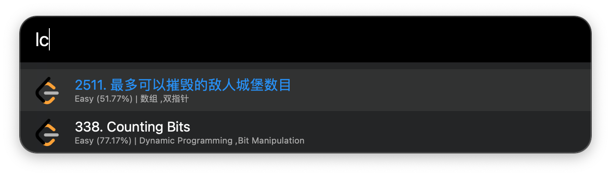

# LeetCode Alfred Workflow

## Features

- 📅 **Instant Access**: Quickly view today's challenges with a simple Alfred command.
- 🌍 **Region Selection**: Choose between LeetCode US and LeetCode CN platforms.
- 🔍 **Enhanced Search**: Use the keyword followed by a query to search for specific challenges on LeetCode.
- 🏷️ **Informative Tags**: View main topics of each challenge with tags.
- 🌐 **Direct Navigation**: A single click directs you to the challenge page on LeetCode.

## How to Use

1. Trigger Alfred.
2. For daily challenges: Type in your keyword (default is `lc`).
   For specific searches: Type in `lc` followed by your query (e.g. `lc binary tree`).
3. Browse the challenges and press enter on any to open it in your browser.

## Installation

1. Download the updated workflow.
2. Double-click to import into Alfred.
3. Go to settings and select your preferred LeetCode region (US or CN). Adjust other settings as desired.
4. Use the assigned or customized keyword to activate.

## Screenshot

