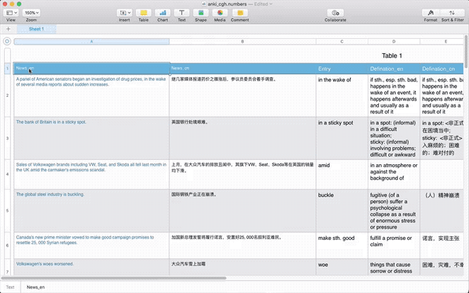

# alfred workflows

## Edit Clipboard with MacVim

### setup
- `tmpdir`: where this workflow holds the tempfile you edit upon, just `echo $TMPDIR`.
- `MacVim`: Choose *Quit MacVim* after last window closes.

## Convert HTML table to Markdown

*Copy table from Numbers and CMD-Ctrl-T to paste as Markdown table*

## Toggle Dark/Light Theme

type `dark` to switch between dark and light theme

## Link to Markdown

type `\\u`

### Acknowledge
- [flat vim icon](https://iconverticons.com/icons/92d8febce1d7a304/)
- [Alfred App Community Forum](https://www.alfredforum.com/topic/10547-edit-clipboard-within-macvim/)
- [schmijos/html-table-parser-python3: A small and simple HTML table parser not requiring any external dependency.](https://github.com/schmijos/html-table-parser-python3)
- [How to quickly switch between light and dark mode in Mojave](https://www.reddit.com/r/mac/comments/8oztql/how_to_quickly_switch_between_light_and_dark_mode/)
